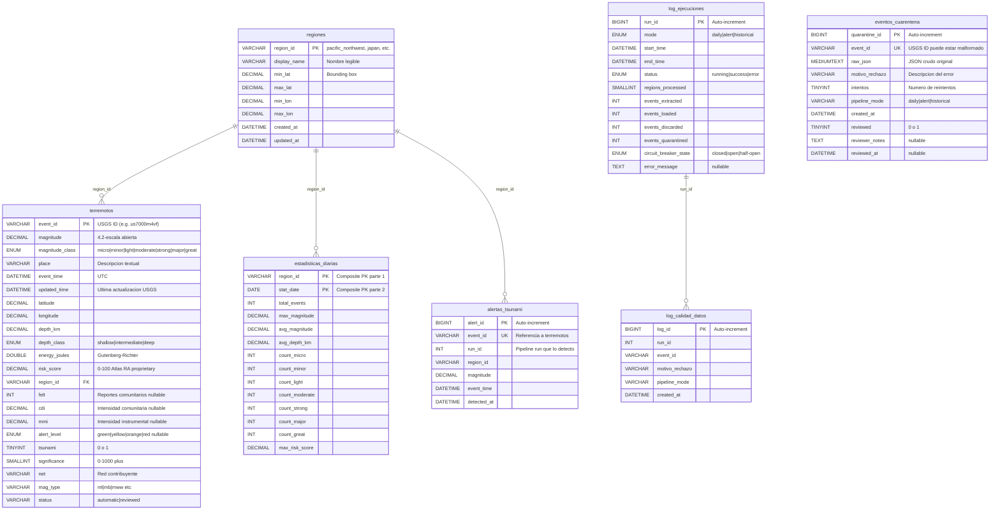

# 🌍 Atlas Reinsurance Analytics — Seismic ETL Pipeline

> **Pipeline ETL automatizado** para monitoreo de actividad sísmica global.
> Extrae datos en tiempo real de la API del USGS, los transforma con cálculos de riesgo propietarios,
> y los carga en MySQL para alimentar modelos actuariales de reaseguros.

[](https://www.python.org/downloads/)
[](https://dev.mysql.com/downloads/)
[](LICENSE)

---

## 📋 Tabla de Contenidos

- [Contexto del Negocio](#-contexto-del-negocio)
- [Arquitectura](#-arquitectura)
- [Diagrama ER](#-diagrama-er)
- [Instalación y Setup](#-instalación-y-setup)
- [Uso del CLI](#-uso-del-cli)
- [Configuración](#-configuración)
- [Fórmula del Risk Score](#-fórmula-del-risk-score)
- [Connection Pool](#-connection-pool)
- [Gestión de Secrets](#-gestión-de-secrets)
- [Migraciones de Base de Datos](#-migraciones-de-base-de-datos)
- [Testing](#-testing)
- [Estructura del Proyecto](#-estructura-del-proyecto)
- [Decisiones de Diseño](#-decisiones-de-diseño)

---

## 🏢 Contexto del Negocio

Atlas Reinsurance Analytics es una empresa de reaseguros que opera en 40 países. Para calcular primas de riesgo,
necesitamos monitorear la actividad sísmica global en tiempo real y mantener un repositorio histórico que alimente
nuestros modelos actuariales.

Este pipeline ETL reemplaza un proceso manual basado en PDFs semanales con un sistema automatizado que:

- **Extrae** datos sísmicos de 8 regiones del mundo cada 5 minutos (modo alerta) o cada 24 horas (modo diario)
- **Transforma** los datos crudos en métricas de riesgo usando cálculos propietarios
- **Carga** todo en MySQL con idempotencia garantizada (UPSERT)

### 🗺️ Regiones Monitoreadas

| Región | ID interno | Zona geográfica |
|---|---|---|
| Pacífico Noroeste (EE.UU.) | `pacific_northwest` | Washington, Oregon |
| California | `california` | Falla de San Andrés |
| Japón | `japan` | Cinturón del Pacífico |
| Indonesia | `indonesia` | Archipiélago de Sunda |
| Chile – Perú | `south_america_west` | Subducción de Nazca |
| Mediterráneo | `mediterranean` | Turquía, Grecia, Italia |
| Himalaya | `himalaya` | Nepal, India |
| Nueva Zelanda | `new_zealand` | Placa del Pacífico |

---

## 🏗️ Arquitectura

```
┌─────────────────┐     ┌──────────────────┐     ┌─────────────────┐
│   USGS API      │────▷│   EXTRACT        │────▷│   TRANSFORM     │
│   (GeoJSON)     │     │   extractor.py   │     │   transformer.py│
│                 │     │                  │     │                 │
│  • 8 regions    │     │  • Retry 3x      │     │  • Classify mag │
│  • Real-time    │     │  • Rate limit    │     │  • Risk score   │
│  • Historical   │     │  • Circuit break │     │  • Deduplicate  │
└─────────────────┘     │  • Pydantic v2   │     │  • Quarantine   │
                        └──────────────────┘     └───────┬─────────┘
                                                         │
                        ┌──────────────────┐     ┌───────▽─────────┐
                        │   MySQL 8.0      │◁────│   LOAD          │
                        │                  │     │   loader.py     │
                        │  • 7 tables      │     │                 │
                        │  • UPSERT        │     │  • Batch 200    │
                        │  • Advisory lock │     │  • Transactions │
                        │  • Connection    │     │  • Pool SQLAlch │
                        │    pool          │     │  • Advisory lock│
                        └──────────────────┘     └─────────────────┘
```

### Flujo de datos

1. **Extract** → Llama a la API del USGS para cada región, valida con Pydantic v2, filtra solo `earthquake`
2. **Transform** → Convierte timestamps, clasifica magnitud/profundidad, calcula energía y risk_score, deduplica
3. **Load** → UPSERT en batches de 200 con transacciones explícitas, recalcula estadísticas diarias
4. **Report** → Genera reporte Markdown y gráficos matplotlib

---

## 📊 Diagrama ER



### Relaciones clave

- **`regiones` → `terremotos`**: FK en `region_id`. Cada terremoto pertenece a una región.
- **`terremotos`**: PK = `event_id` del USGS. Permite UPSERT idempotente.
- **`alertas_tsunami`**: Unique key en `event_id` para evitar duplicados.
- **`estadisticas_diarias`**: PK compuesta (`region_id`, `stat_date`). Recalculada cada ejecución.
- **`eventos_cuarentena`**: Registros que fallaron transformación, pendientes de revisión DQ.

---

## 🚀 Instalación y Setup

### Opción 1: Docker (recomendada)

```bash
# Clonar el repositorio
git clone https://github.com/tu-usuario/seismic-etl-pipeline.git
cd seismic-etl-pipeline

# Levantar MySQL + ejecutar pipeline
docker-compose up -d

# Verificar que MySQL está listo
docker exec -it mysql-seismic mysql -u root -patlas2025 -e "SHOW DATABASES;"

# Ejecutar el pipeline
docker-compose run pipeline python main.py --mode alert --verbose
```

### Opción 2: Instalación local

#### Prerrequisitos
- Python 3.9+
- MySQL 8.0+ (local o Docker)

```bash
# 1. Clonar el repositorio
git clone https://github.com/tu-usuario/seismic-etl-pipeline.git
cd seismic-etl-pipeline

# 2. Crear entorno virtual
python -m venv venv
source venv/bin/activate  # Linux/Mac
# venv\Scripts\activate   # Windows

# 3. Instalar dependencias
pip install -r requirements.txt

# 4. Configurar MySQL (opción Docker rápida)
docker run --name mysql-seismic \
  -e MYSQL_ROOT_PASSWORD=atlas2025 \
  -e MYSQL_DATABASE=seismic_db \
  -p 3306:3306 \
  -d mysql:8.0

# 5. Crear archivo .env
cp config/.env.example config/.env
# Editar config/.env con tus credenciales si difieren

# 6. Inicializar la base de datos
mysql -h 127.0.0.1 -u root -patlas2025 seismic_db < sql/migrations/V1__init_schema.sql
mysql -h 127.0.0.1 -u root -patlas2025 seismic_db < sql/migrations/V2__add_quarantine_table.sql

# 7. Verificar salud
python health_check.py --verbose

# 8. Ejecutar el pipeline
python main.py --mode alert --verbose
```

---

## 💻 Uso del CLI

### Modos de ejecución

```bash
# ─── Modo diario: últimas 24h, todas las regiones, mag ≥ 1.0 ─────
python main.py --mode daily

# ─── Modo alerta: última hora, global, mag ≥ 4.5 ─────────────────
python main.py --mode alert

# ─── Backfill histórico: rango personalizado ──────────────────────
python main.py --mode historical --start-date 2024-01-01 --end-date 2024-06-30
```

### Opciones adicionales

```bash
# Solo una región específica
python main.py --mode daily --region japan

# Dry-run: extrae y transforma pero NO carga a MySQL
python main.py --mode daily --dry-run

# Logging verbose (nivel DEBUG)
python main.py --mode daily --verbose

# Reset del circuit breaker antes de ejecutar
python main.py --mode daily --reset-circuit-breaker

# Config file personalizado
python main.py --mode daily --config path/to/custom_config.yaml
```

### Comandos de conveniencia (Makefile)

```bash
make daily          # Pipeline diario
make alert          # Pipeline en modo alerta
make test           # Ejecutar tests unitarios
make test-cov       # Tests con coverage
make docker-up      # Levantar Docker Compose
make health         # Health check
make clean          # Limpiar artefactos
make help           # Ver todos los comandos
```

---

## ⚙️ Configuración

### `config/config.yaml`

Toda la configuración del pipeline está externalizada en YAML:

| Sección | Parámetro | Default | Descripción |
|---|---|---|---|
| `api` | `base_url` | USGS endpoint | URL base de la API |
| `api` | `rate_limit_seconds` | `1.0` | Delay entre requests |
| `api` | `request_timeout_seconds` | `30` | Timeout HTTP |
| `api` | `max_retries` | `3` | Reintentos en error 5xx/timeout |
| `api` | `retry_backoff_seconds` | `2` | Backoff exponencial base (2→4→8) |
| `api` | `max_segment_days` | `30` | Máximo de días por segmento en modo histórico |
| `pipeline` | `batch_size` | `200` | Registros por batch INSERT |
| `circuit_breaker` | `failure_threshold` | `3` | Fallos consecutivos para abrir el circuito |
| `database` | `pool_size` | `5` | Conexiones en el pool |
| `database` | `max_overflow` | `10` | Conexiones extra permitidas |

### `config/.env`

Variables de entorno para credenciales (nunca se commitean):

```env
DB_HOST=127.0.0.1
DB_PORT=3306
DB_NAME=seismic_db
DB_USER=root
DB_PASSWORD=atlas2025
```

---

## 📐 Fórmula del Risk Score

El **risk_score** es una métrica propietaria de Atlas RA (0–100) que combina cuatro factores:

```
risk_score = (mag_norm × 0.40) + (depth_norm × 0.25) + (sig_norm × 0.20) + (pop_proxy × 0.15)
```

| Componente | Fórmula | Peso | Justificación |
|---|---|---|---|
| `mag_norm` | min((M / 10) × 100, 100) | **40%** | La magnitud es el factor dominante de destrucción |
| `depth_norm` | max(0, (1 − depth/700)) × 100 | **25%** | Sismos superficiales causan más daño |
| `sig_norm` | min(sig / 1000 × 100, 100) | **20%** | Significancia USGS combina múltiples factores |
| `pop_proxy` | 0 si felt=null; else min(felt/100 × 100, 100) | **15%** | `felt > 0` sugiere cercanía a zona poblada |

**Ejemplo**: Un sismo de magnitud 7.0 a 10 km de profundidad con 500 reportes "felt" y significancia 800 tendría:
- mag_norm = 70.0
- depth_norm = 98.57
- sig_norm = 80.0
- pop_proxy = 100.0
- **risk_score = 70×0.40 + 98.57×0.25 + 80×0.20 + 100×0.15 = 28 + 24.64 + 16 + 15 = 83.64**

> **Nota**: El campo `sig` del USGS ya combina magnitud, impacto y reportes, pero no incluye profundidad ni cercanía a población de la forma que necesitamos. Por eso creamos nuestro propio `risk_score`.

---

## 🔌 Connection Pool

El pipeline usa **SQLAlchemy connection pooling** para manejar conexiones a MySQL eficientemente:

| Parámetro | Default | Configurable en | Impacto |
|---|---|---|---|
| `pool_size` | 5 | `config.yaml` → `database.pool_size` | Número de conexiones persistentes en el pool. 5 es adecuado para un pipeline single-threaded; incrementar si se paraleliza. |
| `max_overflow` | 10 | `config.yaml` → `database.max_overflow` | Conexiones adicionales creadas bajo demanda cuando el pool está lleno. Se destruyen al liberarse. |
| `pool_timeout` | 30s | `config.yaml` → `database.pool_timeout` | Tiempo máximo de espera para obtener una conexión del pool antes de lanzar un error. |
| `pool_recycle` | 3600s | `config.yaml` → `database.pool_recycle` | Tiempo máximo de vida de una conexión. **Crítico para MySQL**: evita el error `MySQL server has gone away` causado por el timeout `wait_timeout` del servidor (default 8h). Un valor de 3600s (1h) es conservador y seguro. |

### ¿Por qué Connection Pool?

Sin pool, cada batch de 200 registros abriría y cerraría una conexión TCP a MySQL. Con ~10 batches por ejecución, eso son 10 handshakes TCP + autenticación MySQL. El pool mantiene 5 conexiones persistentes, reutilizándolas entre batches.

### Advisory Lock

Antes de cargar datos, el pipeline adquiere un MySQL advisory lock (`GET_LOCK('seismic_etl_pipeline', 0)`) para garantizar que solo una instancia corra a la vez. Esto previene:
- Race conditions en el UPSERT
- Datos duplicados o corruptos
- Deadlocks en las transacciones por batch

---

## 🔐 Gestión de Secrets

### Desarrollo local

En desarrollo, los secrets se manejan con **`python-dotenv`** cargando el archivo `.env`:

```
config/.env          ← Archivo REAL con credenciales (excluido por .gitignore)
config/.env.example  ← Template con placeholders (commiteado al repo)
```

### Producción

En un entorno productivo real, se recomienda **NO usar archivos `.env`**. En su lugar:

1. **AWS Secrets Manager / Parameter Store**: Inyectar credenciales como variables de entorno en tiempo de ejecución.
   ```yaml
   # En ECS Task Definition o Lambda:
   secrets:
     - name: DB_PASSWORD
       valueFrom: arn:aws:secretsmanager:us-east-1:123456:secret:seismic/db-password
   ```

2. **HashiCorp Vault**: Para infraestructura multi-cloud con rotación automática de credenciales.

3. **Docker Secrets**: Si se ejecuta en Docker Swarm.
   ```yaml
   # docker-compose (producción)
   secrets:
     db_password:
       external: true
   ```

4. **Variables de entorno de CI/CD**: GitHub Actions, GitLab CI, Jenkins — todas permiten definir secrets encriptados
   que se inyectan solo en tiempo de ejecución.

**Regla fundamental**: Los secrets nunca deben estar en código fuente, archivos de configuración commiteados, ni logs.

---

## 🗄️ Migraciones de Base de Datos

### Estructura de migraciones

```
sql/
├── init_db.sql              ← Script maestro de primera instalación
└── migrations/
    ├── V1__init_schema.sql  ← Schema inicial (6 tablas)
    └── V2__add_quarantine_table.sql  ← Tabla de cuarentena
```

### Ejecución manual

```bash
# Primera instalación completa
mysql -h 127.0.0.1 -u root -patlas2025 seismic_db < sql/migrations/V1__init_schema.sql
mysql -h 127.0.0.1 -u root -patlas2025 seismic_db < sql/migrations/V2__add_quarantine_table.sql
```

### Producción: Alembic o Flyway

En un entorno productivo, las migraciones deben gestionarse con herramientas especializadas:

- **Alembic** (Python): Integración nativa con SQLAlchemy. Ideal para este pipeline.
  ```bash
  alembic upgrade head    # Aplicar todas las migraciones pendientes
  alembic revision --autogenerate -m "add new column"
  ```

- **Flyway** (Java/CLI): Estándar en entornos corporativos con múltiples lenguajes.
  ```bash
  flyway migrate          # Ejecutar migraciones pendientes
  flyway info             # Estado actual del schema
  ```

Ambas herramientas mantienen una tabla de control (`alembic_version` o `flyway_schema_history`) que rastrea qué migraciones se han aplicado, evitando ejecuciones duplicadas.

---

## 🧪 Testing

### Ejecutar tests

```bash
# Tests unitarios (sin MySQL, sin API calls)
pytest tests/ -v -m unit

# Con reporte de cobertura
pytest tests/ -v --cov=src --cov-report=term-missing

# Solo un archivo de test
pytest tests/test_transformer.py -v
```

### Estructura de tests

| Archivo | Qué testea |
|---|---|
| `test_transformer.py` | Clasificación magnitud, profundidad, energía, risk_score, asignación de región |
| `test_extractor.py` | Requests mockeados, retry, circuit breaker, segmentación de fechas |
| `test_models.py` | Validación Pydantic: schema válido, campos faltantes, coordenadas inválidas |
| `test_loader.py` | Batch size configurable, circuit breaker state machine, quarantine records |
| `conftest.py` | Fixtures compartidas: regiones, config, sample API response |
| `fixtures/sample_response.json` | GeoJSON de ejemplo con 4 eventos (3 earthquakes + 1 quarry blast) |

### Filosofía de testing

- **Sin HTTP reales**: Todos los tests usan `unittest.mock.patch` para simular la API
- **Fixtures estáticas**: El JSON de ejemplo en `tests/fixtures/` asegura tests deterministas
- **Markers**: `@pytest.mark.unit` para tests rápidos, `@pytest.mark.integration` para tests con BD

---

## 📁 Estructura del Proyecto

```
seismic-etl-pipeline/
├── README.md                          # Este archivo
├── requirements.txt                   # Dependencias Python
├── main.py                           # Punto de entrada CLI
├── health_check.py                   # Verificación de salud del sistema
├── Makefile                          # Comandos de conveniencia
├── Dockerfile                        # Container image del pipeline
├── docker-compose.yml                # MySQL + pipeline
├── .gitignore                        # Exclusiones de git
├── config/
│   ├── config.yaml                   # Parámetros del pipeline (sin secrets)
│   ├── .env.example                  # Template de credenciales
│   └── .env                          # Credenciales REALES (excluido por .gitignore)
├── sql/
│   ├── init_db.sql                   # Script maestro de primera instalación
│   ├── useful_queries.sql            # 10 queries de ejemplo para actuarios
│   └── migrations/
│       ├── V1__init_schema.sql       # Schema inicial (6 tablas + regiones seed)
│       └── V2__add_quarantine_table.sql  # Tabla de cuarentena
├── src/
│   ├── __init__.py                   # Package marker
│   ├── extractor.py                  # E: API USGS con retry + circuit breaker
│   ├── transformer.py                # T: Clasificación, risk_score, validación
│   ├── loader.py                     # L: UPSERT MySQL con connection pool
│   ├── aggregator.py                 # Estadísticas diarias recalculadas
│   ├── models.py                     # Pydantic v2 + dataclasses
│   ├── reporter.py                   # Reporte Markdown + matplotlib
│   ├── logger_config.py              # Logging centralizado (console + file)
│   └── utils.py                      # Circuit breaker, rate limiter, advisory lock
├── tests/
│   ├── conftest.py                   # Fixtures compartidas
│   ├── test_transformer.py           # Tests de clasificación y cálculos
│   ├── test_extractor.py             # Tests de extracción (mocked)
│   ├── test_loader.py                # Tests de carga (mocked)
│   ├── test_models.py                # Tests de validación Pydantic
│   └── fixtures/
│       └── sample_response.json      # GeoJSON de ejemplo
├── logs/
│   └── .gitkeep                      # Directorio para logs (excluido contenido)
└── output/
    └── .gitkeep                      # Directorio para reportes y gráficos
```

---

## 🧠 Decisiones de Diseño

### ¿Por qué UPSERT y no INSERT?

El USGS actualiza eventos constantemente: cambia la magnitud estimada, agrega el campo `alert` después de revisión
humana, y actualiza el conteo de reportes `felt`. Con `INSERT ... ON DUPLICATE KEY UPDATE`, cada ejecución del
pipeline actualiza automáticamente los eventos existentes con los datos más recientes, sin fallar por duplicados.

### ¿Por qué Circuit Breaker?

La API del USGS es gratuita y pública, lo que significa que no tiene SLAs. Si sufre una caída prolongada,
nuestro pipeline no debería bombardearla con reintentos infinitos. El circuit breaker (patrón Hystrix simplificado)
detecta 3 fallos consecutivos y "abre el circuito", rechazando todas las requests siguientes hasta que un
operador lo resetee manualmente o se verifique que la API volvió.

### ¿Por qué Advisory Lock?

En producción, el pipeline se ejecuta con cron. Si un cron job se retrasa y se solapa con el siguiente,
dos instancias intentarían hacer UPSERT simultáneamente, creando race conditions. El advisory lock
de MySQL (`GET_LOCK`) es un mutex a nivel de servidor que garantiza exclusión mutua sin tablas adicionales.

### ¿Por qué Quarantine en vez de descartar?

En el dominio financiero de reaseguros, perder datos es inaceptable. Si un evento no puede procesarse
(campo inesperado, error de cálculo), lo guardamos en `eventos_cuarentena` con el JSON crudo para que
el equipo de Data Quality lo revise manualmente. Nunca usamos `except: pass`.

### ¿Por qué Pydantic v2 para validación?

Un `KeyError` a mitad del transformer es difícil de diagnosticar en producción. Pydantic valida el schema
de la respuesta API **antes** de la transformación, dando errores claros como:
```
ValidationError: 1 validation error for USGSGeometry
coordinates -> value is not a valid list (type=type_error.list)
```
Esto protege el pipeline si USGS cambia su API sin previo aviso.

---

## 📈 Clasificaciones

### Magnitud (escala Richter)

| Rango | Clase | Descripción |
|---|---|---|
| < 2.0 | `micro` | Generalmente no sentido |
| 2.0 – 3.9 | `minor` | Sentido levemente |
| 4.0 – 4.9 | `light` | Daños menores posibles |
| 5.0 – 5.9 | `moderate` | Daños a estructuras débiles |
| 6.0 – 6.9 | `strong` | Daños significativos |
| 7.0 – 7.9 | `major` | Daños graves en área amplia |
| ≥ 8.0 | `great` | Devastador |

### Profundidad

| Rango | Clase | Impacto |
|---|---|---|
| 0 – 70 km | `shallow` | Más destructivo en superficie |
| 70 – 300 km | `intermediate` | Impacto moderado |
| > 300 km | `deep` | Generalmente menos daño |

### Energía (Gutenberg-Richter)

```
E = 10^(1.5 × M + 4.8) joules
```

Un incremento de 1.0 en magnitud = ~31.6× más energía liberada.

---

*Los terremotos no esperan. Tu pipeline tampoco debería.*

**— Equipo de Data Engineering, Atlas Reinsurance Analytics**
